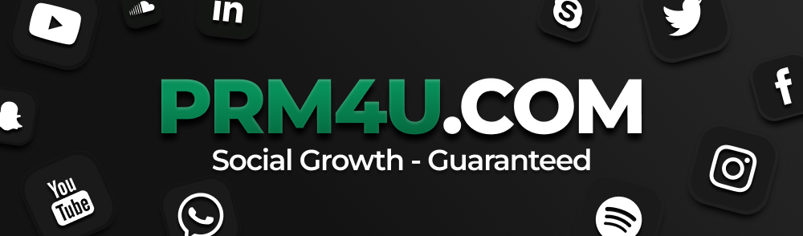

  

  <em>Best SMM Panel – Social Growth · Guaranteed · Marketing Automation & SEO Tools</em>

  
  
  
  

---

# Marketing Toolkit & SMM Panel for Business Growth

Welcome to the **Marketing Toolkit and SMM panel** — an all-in-one open-source project designed to automate **social media marketing**, SEO tasks, and digital promotion across more than 70 platforms.  
This repository provides scripts, guides, and resources to help developers, agencies, and startups achieve scalable **business growth** with automation, analytics, and real-time tracking.

---

## 📖 Introduction to Marketing Automation

**Marketing** is no longer limited to traditional advertising. In the digital age, companies need integrated solutions that combine **SEO tools**, **SMM panel services**, and **analytics dashboards**.  
By centralizing these features, businesses can save time, cut costs, and deliver consistent results across multiple platforms such as Telegram, Instagram, TikTok, YouTube, Reddit, Facebook, and X (Twitter).

The goal of this project is to provide a free, open-source **marketing toolkit** that helps developers and businesses quickly build their own **SMM panel**, automate workflows, and integrate **marketing automation** into existing systems.  

With proper use, this toolkit becomes a full-fledged **digital marketing ecosystem** capable of supporting startups, agencies, and enterprises.

---

## 🚀 Why Use an SMM Panel for Marketing?

An **SMM panel** (Social Media Marketing panel) is a powerful digital tool that allows users to manage and automate marketing services, such as:

- Increasing followers, likes, and comments on social platforms.  
- Running paid or free campaigns with targeted results.  
- Tracking analytics in real time.  
- Reselling marketing services to clients.  

**Key benefits for business growth:**

1. **Scalability** — handle thousands of tasks at once with automation.  
2. **Affordability** — a **cheap SMM panel** provides services at low rates while maintaining reliability.  
3. **Automation** — minimize manual work with bots and scripts.  
4. **Multi-platform support** — one place for managing Telegram, Instagram, TikTok, YouTube, and more.  
5. **Reseller opportunities** — agencies can resell services via a white-label panel.  
6. **Analytics integration** — gain real-time insights into campaigns and ROI.  

---

## 🛠 Features of the Marketing Toolkit

This repository offers more than just scripts — it is a **marketing software stack** for developers and businesses.

### 1. SEO Tools
- Automated SEO audit scripts.  
- Keyword research utilities with export options.  
- Backlink tracking and competitor analysis.  
- On-page and off-page optimization guides.  
- Tools for SERP monitoring and search trend analysis.  

### 2. Social Media Automation
- Bots for content publishing and scheduling.  
- Growth hacking tactics for **social media marketing**.  
- Tools for managing engagement (likes, shares, comments).  
- Scripts for integrating APIs from Instagram, TikTok, Telegram, and YouTube.  
- Automated community management and group moderation.  

### 3. Analytics Dashboards
- Real-time traffic and conversion tracking.  
- Multi-platform reporting in a single interface.  
- Campaign success metrics and engagement ratios.  
- Competitor benchmarking and trend visualization.  

### 4. API Integration
- Ready-to-use API examples in Python, PHP, and Node.js.  
- Tutorials for connecting external SMM panels.  
- JSON/CSV data exports for advanced reporting and machine learning.  
- Hooks for integration with CRM or ERP systems.  

### 5. Business Growth Modules
- White-label **reseller panel** instructions for agencies.  
- Lead generation scripts and automation funnels.  
- Tools for startups to launch campaigns quickly.  
- Email and chatbot integration for multi-channel marketing.  

---

## 📊 Marketing and Business Growth Strategies

A modern **marketing toolkit** must combine automation with strategy. Below are proven methods supported by this repository:

1. **Content Marketing** — plan, schedule, and distribute posts automatically.  
2. **Influencer Marketing** — connect with creators and track ROI through analytics dashboards.  
3. **Performance Marketing** — analyze ad spend with clear KPIs and attribution models.  
4. **SEO Audit** — optimize websites for higher search engine rankings and organic traffic.  
5. **Growth Hacking** — test, measure, and scale experimental tactics.  
6. **Reselling via SMM Panel** — generate recurring revenue by offering clients affordable services.  
7. **Omnichannel Marketing** — combine email, SEO, and social automation in one workflow.  

With the right balance of **marketing automation** and creativity, businesses can achieve rapid **digital growth** and competitive advantage.

---

## 💡 Use Cases

### For Startups
- Launch digital campaigns without large budgets.  
- Use **cheap SMM panel** services to gain initial traction.  
- Analyze user behavior with built-in dashboards.  
- Automate repetitive tasks and focus on innovation.  

### For Agencies
- Provide scalable services to multiple clients at once.  
- Use white-label reseller panels to expand business.  
- Automate reporting and save staff hours.  
- Combine SEO services with SMM to create complete marketing packages.  

### For Developers
- Build and customize an **open-source marketing panel**.  
- Integrate APIs for SEO, analytics, and social media growth.  
- Experiment with **marketing software** modules and contribute improvements.  
- Use the toolkit as a foundation for SaaS projects.  

---

## 🌐 Roadmap

- [ ] Add AI-based SEO keyword clustering.  
- [ ] Expand social automation tools (LinkedIn, Pinterest).  
- [ ] Create React-based marketing dashboard.  
- [ ] Add tutorials for deploying on Docker and Kubernetes.  
- [ ] Release official Python and JavaScript SDKs.  

---

## ❓ FAQ

**Q: What is the role of an SMM panel in marketing?**  
A: It provides automated services (followers, likes, comments, SEO tools) that accelerate digital promotion.  

**Q: Can SEO and SMM work together?**  
A: Yes. SEO builds authority, while SMM increases visibility. Together, they drive organic and viral traffic.  

**Q: Who should use this repository?**  
A: Freelancers, agencies, startups, and developers who need scalable and automated **marketing solutions**.  

**Q: Is it possible to resell services?**  
A: Absolutely. The repository includes guidelines for setting up a **white-label reseller SMM panel**.  

---

## ✅ Conclusion

The **Marketing Toolkit & SMM Panel** is more than just a set of scripts — it’s a complete **business growth framework**.  
By combining **SEO tools**, **SMM automation**, and **analytics dashboards**, this project delivers everything needed for agencies, startups, and developers to thrive in the competitive digital market.  

👉 Explore more at [https://prm4u.com](https://prm4u.com)  

